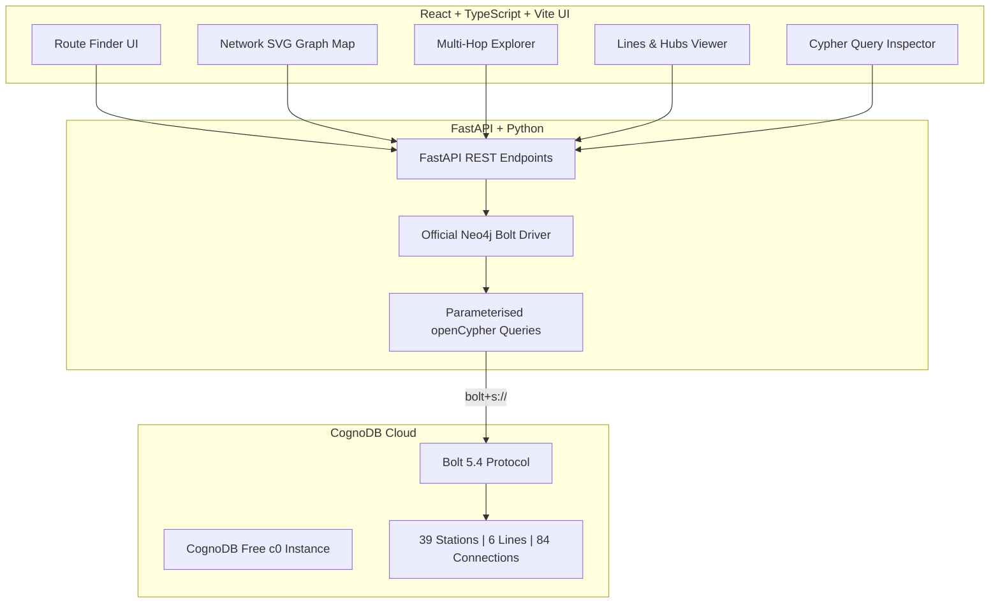
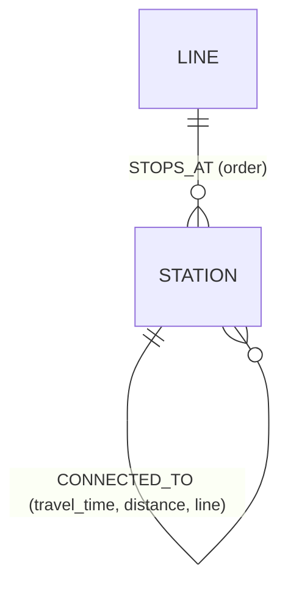

# 🚇 MetroGraph Explorer — Public Transport Route Engine
> Built for the **WEXA AI Take-Home Assignment**  
> Powered by **CognoDB Cloud** (openCypher over Bolt 5.x) + **FastAPI (Python)** + **React & TypeScript (Vite)**

🔗 **Live Deployments**:
- **Frontend (Vercel)**: [https://cognodb-hazel.vercel.app/](https://cognodb-hazel.vercel.app/)
- **Backend API (Render)**: [https://cognodb-n8cr.onrender.com/docs](https://cognodb-n8cr.onrender.com/docs)
- **API Health**: [https://cognodb-n8cr.onrender.com/health](https://cognodb-n8cr.onrender.com/health)

---

## 📌 1. Use Case & "Why a Graph Database?"

### The Problem
Public transit networks (metro corridors, suburban railway lines, and multi-modal interchanges) are inherently **graphs**:
- **Stations** are discrete spatial intersections (**Nodes**).
- **Transit lines** service ordered stops (**Relationships**).
- **Physical segments** connect consecutive stations with travel duration and distance weights (**Edges**).

### Why a Graph Database Beats a Relational Schema
In traditional relational databases (SQL / PostgreSQL / MySQL), modeling transit networks requires multiple junction tables (`stations`, `lines`, `line_stops`, `connections`). Answering core transit queries in SQL becomes awkward, slow, and mathematically unnatural:

1. **Shortest Path & Optimal Routing (Multi-Hop Traversals)**:
   - **In SQL**: Finding shortest path between arbitrary stations requires deep recursive Common Table Expressions (`WITH RECURSIVE`), cycle tracking tables, or expensive external Dijkstra computations over millions of rows.
   - **In CognoDB (Graph)**: openCypher provides native pointer-hopping `shortestPath((src)-[:CONNECTED_TO*1..15]-(dst))` which traverses pre-materialized index-free adjacency pointers in constant-time graph step operations.

2. **Variable-Depth Reachability (N Hops Away)**:
   - **In SQL**: Asking *"What stations can I reach in 3 hops?"* requires 3 nested `JOIN`s or recursive query depth scanning.
   - **In CognoDB (Graph)**: A clean declarative pattern: `MATCH (src)-[:CONNECTED_TO*1..3]-(nearby) RETURN DISTINCT nearby`.

3. **Interchange Hubs & Multi-Line Centrality**:
   - **In SQL**: Multi-table aggregations, `GROUP BY` and `HAVING` filters across cross-referenced line junction tables.
   - **In CognoDB (Graph)**: `MATCH (s:Station)<-[:STOPS_AT]-(l:Line) WITH s, count(l) AS degree WHERE degree > 1 RETURN s`.

---

## 📐 2. Graph Data Model

### Node Labels
- `(:Station)` — Properties: `id` (Unique string), `name`, `city`, `zone`, `lat`, `lon`
- `(:Line)` — Properties: `id` (Unique string), `name`, `type` (`subway`, `rail`), `color`

### Relationships
- `(:Line)-[:STOPS_AT {order: Int}]->(:Station)`: Defines the ordered stop sequence on a line.
- `(:Station)-[:CONNECTED_TO {line: String, line_type: String, line_color: String, travel_time: Int, distance: Float}]->(:Station)`: Bidirectional edge connecting consecutive stations.

### Architecture Diagram


### Graph Entity Model


---

## ⚡ 3. Key Parameterised Cypher Queries

All queries are strictly parameterised using the official Neo4j driver with zero string concatenation.

### 3.1 Shortest Path Traversal (Multi-Hop with Edge Weights)
```cypher
MATCH (src:Station {id: $source_id}),
      (dst:Station {id: $target_id})
MATCH p = shortestPath((src)-[:CONNECTED_TO*1..15]-(dst))
WITH p,
     [n IN nodes(p) | n.name]    AS station_names,
     [n IN nodes(p) | n.id]      AS station_ids,
     relationships(p)             AS rels
RETURN station_ids,
       station_names,
       [r IN rels | {
           line:        r.line,
           line_type:   r.line_type,
           line_color:  r.line_color,
           travel_time: r.travel_time,
           distance:    r.distance
       }] AS segments,
       reduce(t = 0, r IN rels | t + r.travel_time) AS total_time,
       reduce(d = 0.0, r IN rels | d + r.distance)  AS total_distance,
       length(p) AS hops
LIMIT 3
```

### 3.2 Variable-Depth Multi-Hop Reachability (1 to 5 Hops)
```cypher
MATCH (src:Station {id: $station_id})
MATCH p = (src)-[:CONNECTED_TO*1..3]-(nearby:Station)
WHERE nearby.id <> $station_id
WITH nearby, min(length(p)) AS hops_away
RETURN nearby.id   AS id,
       nearby.name AS name,
       nearby.city AS city,
       nearby.zone AS zone,
       hops_away
ORDER BY hops_away, nearby.name
LIMIT 30
```

### 3.3 Interchange Hubs (Degree Centrality)
```cypher
MATCH (s:Station)<-[:STOPS_AT]-(l:Line)
WITH s, count(l) AS line_count, collect(l.name) AS lines
WHERE line_count > 1
RETURN s.id AS id, s.name AS name, s.city AS city, line_count, lines
ORDER BY line_count DESC, s.name
```

---

## 🚀 4. Setup & Running Locally

### Prerequisites
- Python 3.10+
- Node.js 18+ & npm
- A free **CognoDB Cloud** instance (see Step 4.1)

---

### Step 4.1 — Provision a Free CognoDB Instance
1. Go to [https://console.cognodb.com/signup](https://console.cognodb.com/signup) and create an account (no credit card required).
2. Click **Create Instance** and select the free **c0** tier.
3. Copy your connection URI (`bolt+s://<instance-id>.databases.cognodb.com`), username (`cognodb`), and generated password.

---

### Step 4.2 — Configure Backend `.env`
In `backend/.env`:
```env
COGNODB_URI=bolt+s://<your-instance>.databases.cognodb.com
COGNODB_USER=cognodb
COGNODB_PASSWORD=<your-password>
```

---

### Step 4.3 — Seed Database
```bash
cd backend
pip install -r requirements.txt
python seed_data.py
```
> Populates 39 stations, 6 transit lines (Western Railway, Central Railway, Harbour Line, Metro Line 1, Metro Harbour Link, Pune Suburban Rail), and 84 bidirectional connections with `MERGE` idempotency.

---

### Step 4.4 — Start Backend API
```bash
cd backend
uvicorn main:app --reload --port 8000
```
API runs at `http://localhost:8000` (Interactive Swagger docs at `http://localhost:8000/docs`).

---

### Step 4.5 — Start Frontend
```bash
cd frontend
npm install
npm run dev
```
Frontend opens at `http://localhost:5173`.

---

## 📦 5. Project Structure

```
CognoDB/
├── backend/
│   ├── database.py         # Neo4j/CognoDB connection pool & error handler
│   ├── main.py             # FastAPI REST endpoints & error handling
│   ├── seed_data.py        # Realistic network seed script (idempotent MERGE)
│   ├── requirements.txt    # Python dependencies (neo4j, fastapi, uvicorn, etc.)
│   ├── .env.example        # Environment variable template
│   ├── models/
│   │   └── schemas.py      # Pydantic request/response schemas
│   └── queries/
│       └── cypher.py       # Parameterized openCypher queries
├── frontend/
│   ├── src/
│   │   ├── api.ts          # API client with live query event broadcasting
│   │   ├── types.ts        # TypeScript data interfaces
│   │   ├── App.tsx         # Root application & tab routing
│   │   ├── index.css       # Dark glassmorphic design system
│   │   └── components/
│   │       ├── Navbar.tsx         # Brand, tabs, live DB connection badge
│   │       ├── RouteFinder.tsx    # Shortest path & step-by-step itinerary
│   │       ├── NetworkMap.tsx     # Interactive SVG transit network graph
│   │       ├── NearbyExplorer.tsx # Multi-hop reachability slider (1-5 hops)
│   │       ├── LineViewer.tsx     # Line corridors & interchange hubs
│   │       └── CypherViewer.tsx   # Live query stream & SQL comparison
│   ├── package.json
│   ├── tsconfig.json
│   └── vite.config.ts
└── README.md
```

---

## 🛡️ 6. Engineering Highlights
- **100% Parameterized Cypher**: Prevents injection and enables query plan caching.
- **Graceful Error Handling**: Detects unreachable database states (`503 Service Unavailable`) and provides real-time UI status pills.
- **Modern UI & Micro-interactions**: Custom SVG transit map with zoom/pan, line filtering, route path highlighting, and real-time execution duration meters.
- **No Hardcoded Credentials**: All secrets are loaded via environment variables and excluded by `.gitignore`.
"# CognoDB" 
